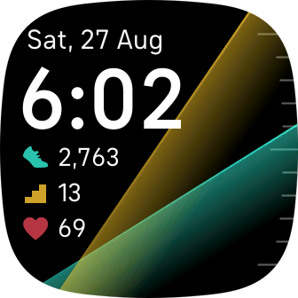

# Clocky Clock!

Designed as a replacement for Spectrum, with a few new features:

* include day of week
* include floors
* ticks on main display
* progress lines are not goal-constrained (pictured step and floor goals are ~4,500 and 10, respectively)
* no tap action

Sleep is lost, unfortunately. Couldn't find a way to get that number. But just swipe up to see your stats; it's right there. 

Yeah, it's a stupid name. Whatever.

## Install

If you want to give it a whirl:
https://gallery.fitbit.com/details/a9bd561e-6f4f-4144-b298-71db34382a7f

Note that I've only tested on Sense. Versa 3 has the same form factor, so it
should work there as well. YMMV.

## Screenshot

Here's what it looks like, at least when I last took a screenshot:

Normally I'd automate that sort of thing as part of the release, but it's sorta
tricky because taking one requires side-loading the app onto my device, using a
non-scriptable tool (the FitBit shell) to capture the image, and then adding the
correct alpha channel. Which isn't impossible, but so far hasn't justified the
hassle of figuring out how to do it.

## Development

Clone, change the `appUUID`, run `fitbit-build` (or the shell). The usual. If
you do awesome things I should know about, submit a PR.
