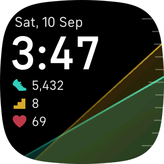

# Clocky Clock!

Designed as a replacement for Spectrum, with a few improvements:

* include day of week
* include floors
* ticks on main display
* progress lines are not goal-constrained
* progress lines are less visually invasive
* no tap action
* automatic sleep mode

Sleep is lost, unfortunately. Couldn't find a way to get that number. But just swipe up to see your stats; it's right there. 

Yeah, it's a stupid name. Whatever.

## Install

If you want to give it a whirl:
https://gallery.fitbit.com/details/a9bd561e-6f4f-4144-b298-71db34382a7f

Note that I've only tested on Sense. Versa 3 has the same form factor, so it
should work there as well. YMMV.

## Screenshot

Here's what it looks like:

And when you're sleeping:

## Development

Clone, change the `appUUID`, run `fitbit-build` (or the shell). The usual. If
you do awesome things I should know about, submit a PR.
